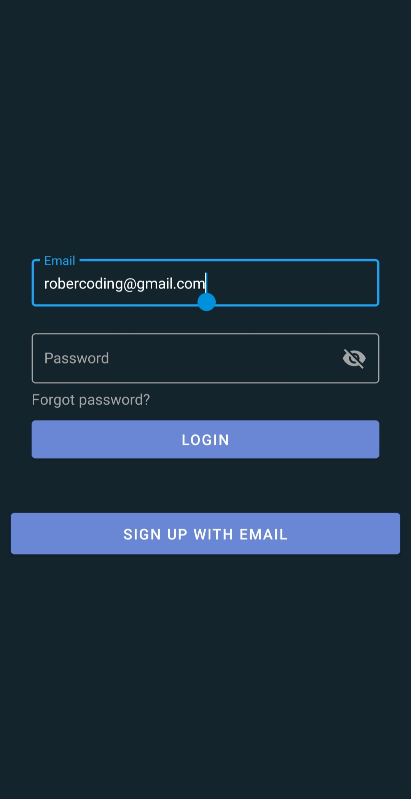
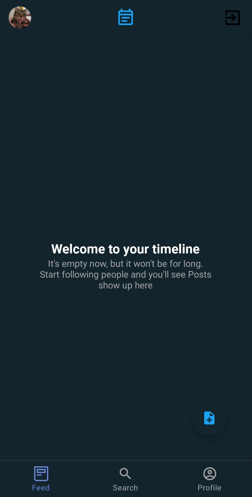

# Blog-App

Blog App is an app to let users create an account to share their thoughts and interact with other people, it's inspired in Twitter.

The app is built with **Kotlin** and **Firebase** using _Cloud Firestore_ to store the data, _Firebase Storage_ to save data images and _Cloud Functions_ to execute the work on server-side. Client-side uses Kotlin and server-side use Node.js (Cloud Functions from Firebase).

#### Features 
* Authentication
* Watch timeline of users you follow and yourself
* Add a post 
* Search user on the app
* See user profile with their posts
* Add profile and background picture to your profile
* Edit profile (Also change username)
* Follow or unfollow user 
 
#### The app has implemented the next things:
* Dagger-Hilt
* Coroutines Flow
* LiveData
* Material Design
* MVI

### Pictures of the application

#### Authentication
| Login | Sign up |
|---|---|
|   |   |

#### Main screens
| Feed welcome | Feed with posts | Post detail |
|---|---|---|
|   |   | |

| Search idle state | Search user | 
|---|---|
|   |   |

| Profile logged in user | Profile with motion layout | Follow other user profile | 
|---|---|---|
|   |   |   | 

| Edit profile |
|---|
|   |

### Why did you use MVI?
MVI is the newest architecture for Android and I've just done a project with MVVM architecture so I wanted to get in touch with other architectures to get a better understanding and experience of the different benefits that each one can contribute to my app.

Having said this, MVI is a single source of truth. That means that this way, you're sure that your Models won't be modified in multiple places and will maintain a single state until the user makes an intention.

**Cycle Representation of MVI**

 

### Why did you use Dagger Hilt?
Dagger Hilt is the latest Dagger framework released, it covers DI (_Dependency Injection_) in a simpler and efficient way. DI task is to create objects and manage them in the whole app.

Dagger Hilt benefits are:
* Help us to reduce boilerplate
* make our code recyclable
* easy use in testing
* Simplified configuration (_From dagger 2 DI_)
* Standardized components

If you're interested in Dagger Hilt and want to get more in touch with this framework then I recommend you to [checkout my spanish article](https://medium.com/@robercoding/c%C3%B3mo-usar-dagger-hilt-en-android-con-ejemplos-kotlin-4122bdfc95dc) where I show with visual graphics and different examples how Dagger Hilt works. 
You can also checkout my [sample app](https://github.com/robercoding/DaggerHilt-Sample-Guide) that I've built for the article. 

### What has been the issues/challenges that you were facing in this project?
**1. How are you going to structure your database to optimize the read/written/updating in without getting high bill from Firebase? (Supposing that we had to take care of that)**

* I started writting down on a notebook on how I would want to see my NoSql database and the process of getting any information from any document/collection.
For example, when I was writting the **Post** model I did put a member variable
to save the profile picture of the user who pertained that post. That didn't make sense since the user could change the profile 
picture and then firebase would had to update _X quantity_ posts to set the new profile picture. So I refactored that part and, set the profile picture member variable to 
the **user** model and that would reduce the operations and would be so much more efficient.

* Other thing I took care of was saving the data on the cache. _Since Room library hasn't been implemented yet_, I've used maps and lists to store posts, users or other documents from other collections, in result reads have been optimized.

In general I had a lot of new experiences that I've learned there and I hadn't any problem with refactoring the app if that made it better and learn from it.

**2. What's the plan for the design of the app?**

* At first I had an idea to focus on _blue_ color but I wasn't sure how to match them together in the app, but I knew that I wanted to make sure the user can recognize differents part of the app making it easy for him to navigate which I did. Finally implemented 4 tones of blue.

* I planned using _Material Design_ since it offers us a clean layout and accessibility to easily modify it.

* I did add different animations to let users know what is going on the app when they press some view component. 

Note: I've been mostly focused on UI and UX aswell since I was lacking of experience and knowledge on this area and I was looking to improve myself there. The result was good but definitely there's room to improve, but I'm satisfied with the results.

**3. What project planning did you use and how do you stay organized with the tasks?**

* I had a lot of different project planning tools to use here, for example Trello (Which I did use in my final project) but this time I did use a notebook. The thing that made me use a notebook was merely personal, I simply like writing on a notebook, but I wouldn't had any problem to use any technology tool for work.

* I started writing down the tasks that I had to do, then I separately started creating little tasks for every task. I would set different levels E/M/H (_Easy/Medium/Hard_) and then I'd set them with a ✔️ once finished or, if I had any problem then I'd write down everything I've done until now and continue with other tasks.
