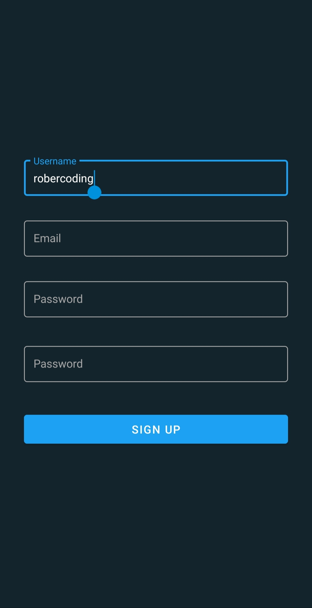

# Blog-App

Blog App is an app to let users create an account to share their thoughts and interact with other people, it's inspired in Twitter.

The app is built with Kotlin and **Firebase** using _Cloud Firestore_ to store the data, _Firebase Storage_ to save data images and _Cloud Functions_ to execute the work on server-side. Client-side uses Kotlin and server-side use Node.js.

Note: The project has been mostly focused on UI and UX aswell since I was lacking of experience and knowledge on this area and I was looking to improve myself there.

#### Features 
* Authentication
* Watch timeline of users you follow and yourself
* Add a post 
* Search user on the app
* See user profile with their posts
* Add profile and background picture to your profile
* Edit profile (Also change username)
* Follow or unfollow user 
 
#### The app has implemented the next things:
* Dagger-Hilt
* Coroutines Flow
* LiveData
* Material Design
* MVI

### Pictures of the application

#### Authentication
| Login | Sign up |
|---|---|
|   |   |

#### Main screens
| Feed | Search |
|---|---|
|   |   |

| Profile logged in user | Profile logged other user | 
|---|---|
|   |   |

| Edit profile |
|---|
|   |